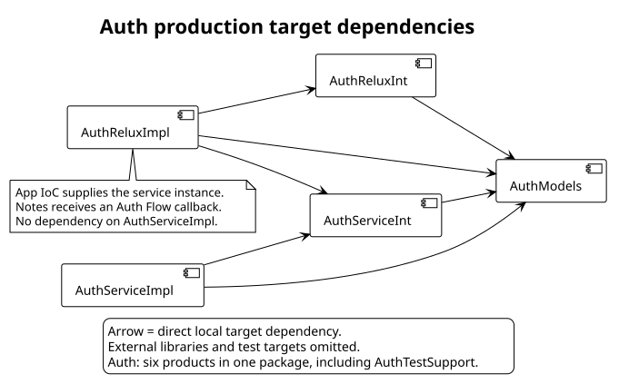
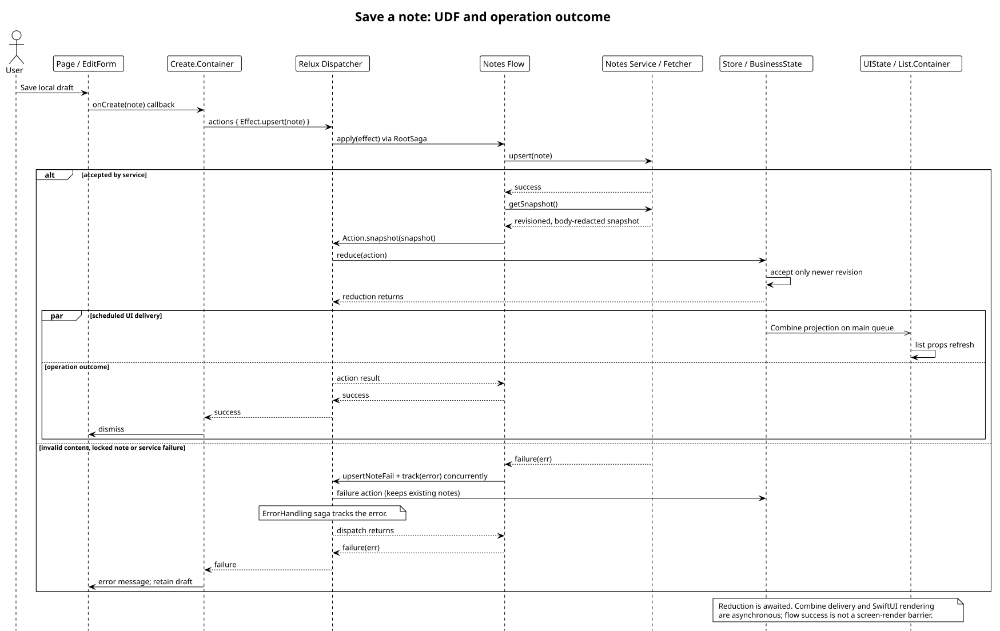
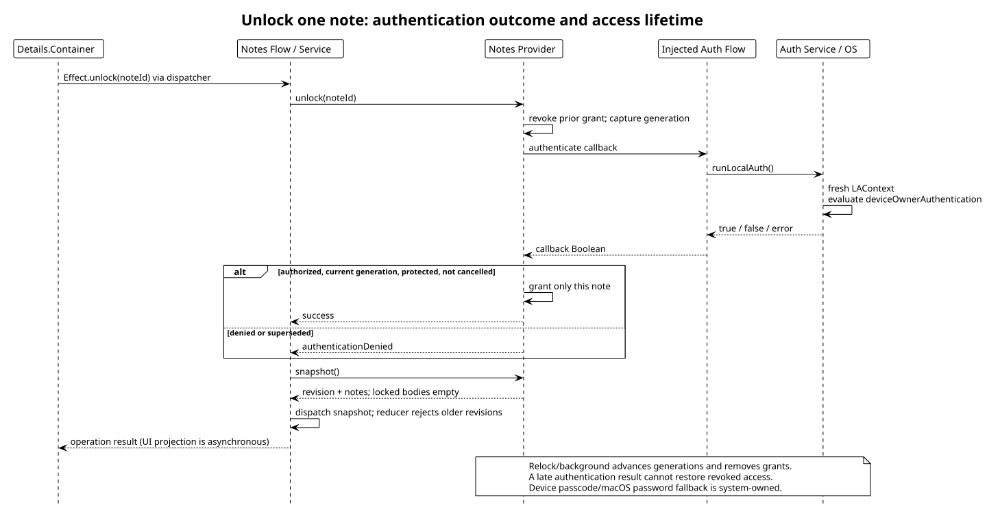

# Architecture diagrams

Each source covers one question, checked against the application composition and package manifests.

| Source | Question | Implementation anchors |
| --- | --- | --- |
| [Auth dependencies](plantuml/component/auth-dependencies.puml) | Which production targets depend on which interfaces? | [Auth manifest](../Packages/Auth/Package.swift) |
| [Notes upsert](plantuml/sequence/notes-upsert.puml) | How does a draft become domain state? | [Flow](../relux_sample/Modules/Notes/Business/Middleware/Notes+Business+Flow.swift), [UI projection](../relux_sample/Modules/Notes/UI/Notes+UI+State.swift) |
| [Note unlock](plantuml/sequence/note-unlock.puml) | Who owns authentication and per-note access? | [Protection pattern](../Docs/Patterns/NOTE_PROTECTION.md) |

## Render locally

Install PlantUML and Graphviz if absent (`brew install plantuml graphviz`). Check `plantuml -version` and `dot -V` first. From the repository root, render all three sources to a task-local output directory:

```bash
mkdir -p .temp/diagrams
plantuml -failfast2 -tpng -o "$PWD/.temp/diagrams" diagrams/plantuml/component/*.puml diagrams/plantuml/sequence/*.puml
```

The command exits nonzero on a source error. Open each PNG and check labels, arrows, clipping, and the stated boundary against its implementation anchors. For scalable export, replace `-tpng` with `-tsvg`. Keep editable sources and the requested small SVG documentation assets in Git. Temporary PNG previews stay under `.temp/`. Render shareable SVGs with `plantuml -failfast2 -tsvg -o "$PWD/diagrams/rendered" diagrams/plantuml/component/*.puml diagrams/plantuml/sequence/*.puml`.

## View the diagrams







Start the learning path at [LearningExercises.md](../Docs/LearningExercises.md). Dependency arrows and runtime messages have different meanings; read each diagram's title and legend before combining them.
